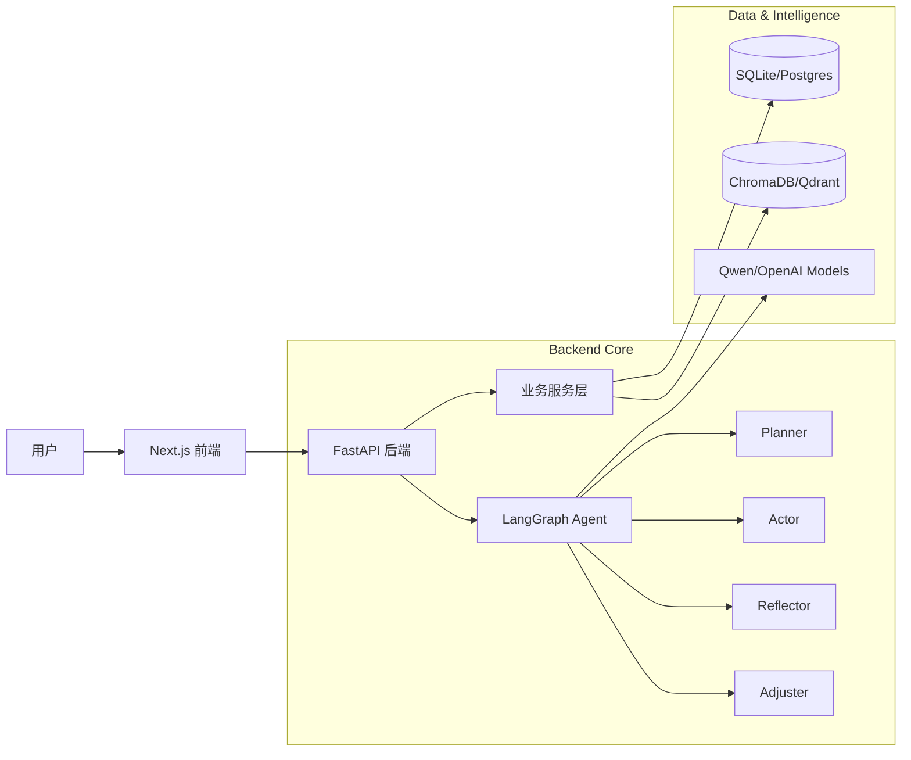

# CarbonCycle-FitAgent 🏋️‍♂️🥗
> **智能碳循环饮食训练 Agent** — 你的私人 AI 健身教练。


**CarbonCycle-FitAgent** 是一个基于 **LangGraph** 的全栈智能体系统，旨在通过科学的**碳循环饮食法 (Carb Cycling)** 帮助用户实现减脂或增肌目标。它不仅仅是一个记录工具，更是一个拥有认知架构的 "AI 教练"，能够像真人一样进行**计划 (Plan)**、**执行 (Act)**、**反思 (Reflect)** 和 **调整 (Adjust)**。

---

## ✨ 核心特性 (Core Features)

### 🧠 认知型 Agent 架构
采用 **Planner-Actor-Reflector-Adjuster** 闭环架构：
*   **Planner**: 每日分析用户状态，生成具体的饮食/训练建议。
*   **Actor**: 与用户进行自然交互，提供鼓励和指导。
*   **Reflector**: 深度反思执行数据（如体重停滞、热量超标），寻找根本原因。
*   **Adjuster**: 根据反思结果，动态调整后续的碳循环策略（如将“高碳日”降级为“中碳日”）。

### 🥗 智能碳循环策略
*   **个性化定制**: 根据 TDEE、体重目标和训练频率，自动计算每日热量和宏量营养素 (Macros)。
*   **动态调整**: 支持手动或 AI 自动调整每日碳水类型（高/中/低碳日）。

### 📸 多模态饮食记录
*   **拍照识别**: 上传食物照片，利用视觉大模型 (Vision LLM) 自动识别并估算热量。
*   **智能手动录入**: 输入食物名称（如“一碗米饭”），AI 自动估算营养成分。

### 📊 深度数据复盘
*   **AI 周报**: 每周生成深度分析报告，解读执行趋势，提供针对性改进建议。
*   **实时仪表盘**: 实时追踪热量缺口、宏量营养素摄入进度。

### 💬 AI 私教对话
*   **上下文感知**: AI 教练了解你的当前计划和历史记录，提供个性化的问答服务。

---

## 🏗️ 系统架构 (Architecture)



### 📂 项目结构
```
CarbonCycle-FitAgent/
├── app/                          # 🔧 后端核心 (FastAPI + LangGraph)
│   ├── agent/                    #   智能体架构
│   │   ├── nodes/                #     Agent 节点 (Planner, Actor, Reflector, Adjuster)
│   │   ├── graph.py              #     LangGraph 图定义
│   │   ├── router.py             #     路由逻辑
│   │   └── state.py              #     状态定义
│   ├── api/                      #   RESTful API 路由
│   │   ├── auth.py               #     认证接口
│   │   ├── chat.py               #     对话接口
│   │   ├── plan.py               #     计划接口
│   │   ├── report.py             #     报告接口
│   │   └── user.py               #     用户接口
│   ├── db/                       #   数据库层
│   │   ├── models.py             #     SQLAlchemy 模型
│   │   ├── db_storage.py         #     存储实现
│   │   └── repositories/         #     数据访问层
│   ├── llm/                      #   LLM 集成
│   │   ├── client.py             #     OpenAI 兼容客户端
│   │   └── tools.py              #     Agent 工具
│   ├── rag/                      #   RAG 检索增强
│   │   ├── embedding.py          #     向量嵌入
│   │   ├── retriever.py          #     检索器
│   │   └── vectorstore.py        #     向量存储
│   ├── services/                 #   业务服务
│   │   ├── carbon_strategy.py    #     碳循环策略
│   │   ├── execution_analysis.py #     执行分析
│   │   ├── adjustment_engine.py  #     调整引擎
│   │   └── report_service.py     #     报告生成
│   ├── memory/                   #   记忆系统
│   │   ├── agent_memory.py       #     Agent 记忆
│   │   └── user_memory.py        #     用户记忆
│   ├── core/                     #   核心配置
│   │   ├── config.py             #     配置管理
│   │   ├── database.py           #     数据库连接
│   │   └── scheduler.py          #     任务调度
│   └── models/                   #   数据模型
│       ├── user.py               #     用户模型
│       ├── plan.py               #     计划模型
│       └── log.py                #     日志模型
├── frontend/                     # 🎨 前端应用 (Next.js + React)
│   ├── src/app/                 #   页面路由
│   └── src/components/          #   UI 组件
└── data/                        # 💾 数据存储 (SQLite, Knowledge Base)
```

---

## 🛠️ 技术栈 (Tech Stack)

*   **Backend**: Python 3.10+, FastAPI, SQLAlchemy (Async), Pydantic
*   **Agent Framework**: LangChain, LangGraph
*   **Frontend**: Next.js 14 (App Router), TypeScript, Tailwind CSS, Shadcn/ui
*   **LLM Providers**: 阿里云百炼 (Qwen-Max, Qwen-Plus, Qwen-VL), OpenAI Compatible
*   **Database**: SQLite (Dev), PostgreSQL (Prod), ChromaDB/Qdrant (Vector Store)

---

## 🚀 快速开始 (Getting Started)

### 前置要求
*   Python 3.10+
*   Node.js 18+
*   LLM API Key (推荐 Qwen 或 OpenAI)

### 1. 后端启动
```bash
# 进入项目根目录
cd CarbonCycle-FitAgent

# 创建并激活虚拟环境 (可选)
python -m venv .venv
source .venv/bin/activate  # Linux/Mac
# .venv\Scripts\activate   # Windows

# 安装依赖
pip install -r requirements.txt

# 配置环境变量
cp .env.example .env
# 编辑 .env 填入你的 LLM_API_KEY

# 启动 API 服务
python run_api.py
```
*后端服务默认运行在 `http://localhost:8000`*

### 2. 前端启动
```bash
# 进入前端目录
cd frontend

# 安装依赖
npm install

# 启动开发服务器
npm run dev
```
*前端页面默认运行在 `http://localhost:3000`*

---

## 📅 最近更新 (Recent Updates 1.30 - 2.5)

*   **2026-02-05**:
    *   ✅ **AI 周报功能上线**: 基于 Agent 的深度周复盘分析。
    *   ✅ **饮食记录增强**: 支持手动输入 + AI 营养估算。
    *   ✅ **策略页升级**: 支持由用户手动切换每日碳水类型。
    *   🐛 **修复**: 解决了后端多进程端口占用导致的 API 无响应问题。
*   **2026-02-03**:
    *   ✅ **Planner 节点增强**: 引入 LLM 生成个性化的每日训练和饮食描述。
*   **2026-01-30**:
    *   ✅ **多模型架构**: 完成 Brain (Qwen-Max), Vision (Qwen-VL), Chat (Qwen-Plus) 的多模型配置。

---

## 📄 License

This project is licensed under the MIT License - see the [LICENSE](LICENSE) file for details.
