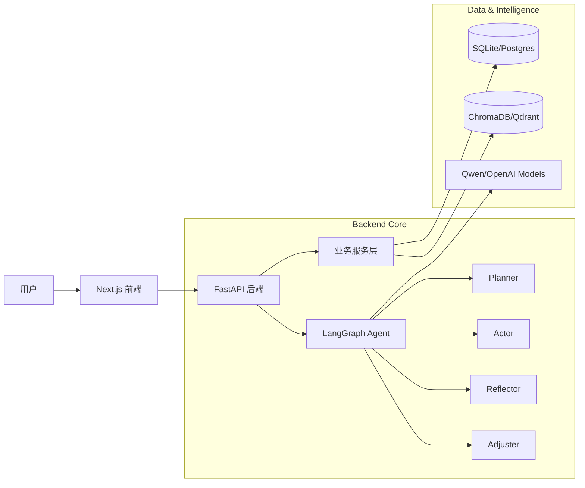
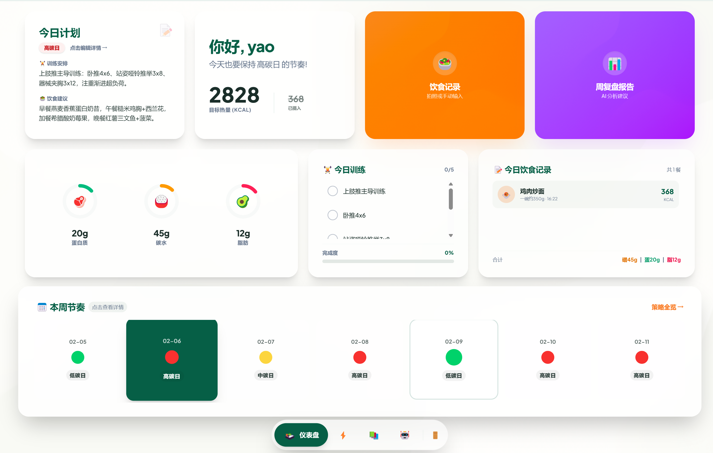
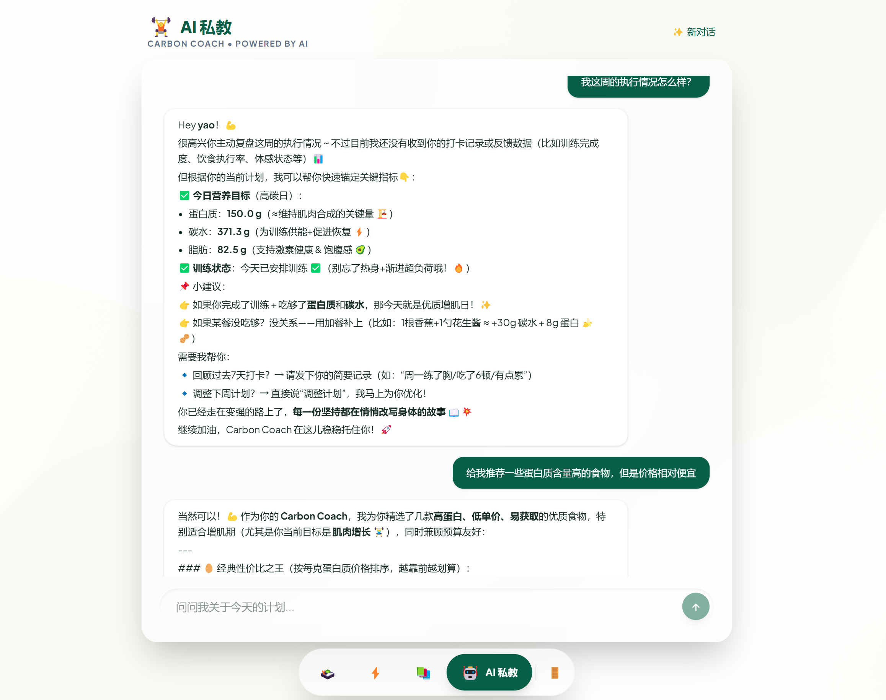

# FitAgent ️🥗🏋️‍♂️
> **融合多模态与 RAG 的智能碳循环饮食训练 Agent** — 你的私人 AI 健身教练

**FitAgent** 是一个基于 **LangGraph** 框架开发的智能饮食健身决策助手，面向饮食管理与健身训练场景，旨在通过科学的**碳循环饮食法**帮助用户实现减脂或增肌目标。它不仅仅是一个记录工具，更是一个拥有认知架构的 "AI 教练"，能够像真人一样进行**计划 (Plan)**、**执行 (Act)**、**反思 (Reflect)** 和 **调整 (Adjust)**。

---

## ✨ 核心特性

### 🧠 认知型 Agent 架构
采用 **Planner-Actor-Reflector-Adjuster** 闭环架构：
*   **Planner**: 每日分析用户状态，生成具体的饮食/训练建议。
*   **Actor**: 与用户进行自然交互，提供鼓励和指导。
*   **Reflector**: 深度反思执行数据（如体重停滞、热量超标），寻找根本原因。
*   **Adjuster**: 根据反思结果，动态调整后续的碳循环策略（如将“高碳日”降级为“中碳日”）。

### 🥗 智能碳循环策略
*   **个性化定制**: 根据 TDEE、体重目标和训练频率，自动计算每日热量和宏量营养素 (Macros)。
*   **动态调整**: 支持手动或 AI 自动调整每日碳水类型（高/中/低碳日）。

### 📸 多模态饮食记录
*   **拍照识别**: 上传食物照片，利用视觉大模型 (Vision LLM) 自动识别并估算热量。
*   **智能手动录入**: 输入食物名称（如“一碗米饭”），AI 自动估算营养成分。

### 📚 Hybrid RAG 知识增强
*   **混合检索**: 采用“向量检索 + BM25 关键词检索”双路召回，而不是仅依赖单一路径向量搜索，提升营养与训练知识匹配的稳定性。
*   **完整链路**: 支持 Markdown 文档解析、基于 Unstructured 的标题级切块、`bge-m3` 向量化、Qdrant 本地持久化存储，以及多路结果加权融合。

### 🛠 Function Calling 工具调用
*   **结构化调用**: 基于 OpenAI 兼容工具调用协议，为模型提供 `calculate_macros`、`query_food_nutrition`、`analyze_deviation`、`get_user_history`、`suggest_adjustment` 等能力。
*   **统一执行**: 模型先返回 `tool_calls`，后端再通过 `ToolExecutor` 统一分发、执行和回填结果，支撑多步分析与动态调整。

### 🧠 Memory 记忆机制
*   **运行记忆**: `AgentMemory` 持久化记录每次 Agent 执行过程中的节点决策、推理链路与最终输出，便于复盘与排障。
*   **用户记忆**: `UserMemory` 持久化保存用户偏好与状态信息，支持更连续的个性化交互与后续策略生成。

### 📊 深度数据复盘
*   **AI 周报**: 每周生成深度分析报告，解读执行趋势，提供针对性改进建议。
*   **实时仪表盘**: 实时追踪热量缺口、宏量营养素摄入进度。

### 💬 AI 私教对话
*   **上下文感知**: AI 教练了解你的当前计划和历史记录，提供个性化的问答服务。

---

## 🏗️ 系统架构



### 🎨 前端界面预览

| 饮食记录页面 | 智能对话页面 |
|------------|------------|
|  |  |

### 📂 项目结构
```
CarbonCycle-FitAgent/
├── app/                          # 后端核心 (FastAPI + LangGraph)
│   ├── agent/                    #   智能体架构
│   │   ├── nodes/                #     Agent 节点 (Planner, Actor, Reflector, Adjuster)
│   │   ├── context.py            #     Agent 上下文整理
│   │   ├── graph.py              #     LangGraph 图定义
│   │   ├── router.py             #     路由逻辑
│   │   └── state.py              #     状态定义
│   ├── api/                      #   RESTful API 路由
│   │   ├── agent.py              #     Agent 相关接口
│   │   ├── auth.py               #     认证接口
│   │   ├── chat.py               #     对话接口
│   │   ├── food.py               #     食物接口
│   │   ├── health.py             #     健康检查接口
│   │   ├── log.py                #     日志接口
│   │   ├── plan.py               #     计划接口
│   │   ├── report.py             #     报告接口
│   │   ├── user.py               #     用户接口
│   │   └── weight.py             #     体重接口
│   ├── db/                       #   数据库层
│   │   ├── models.py             #     SQLAlchemy 模型
│   │   ├── db_storage.py         #     存储实现
│   │   └── repositories/         #     数据访问层
│   ├── llm/                      #   LLM 集成
│   │   ├── client.py             #     OpenAI 兼容客户端
│   │   ├── tool_executor.py      #     Agent 工具执行器
│   │   └── tools.py              #     Agent 工具
│   ├── rag/                      #   RAG 检索增强
│   │   ├── embedding.py          #     向量嵌入
│   │   ├── retriever.py          #     检索器
│   │   └── vectorstore.py        #     向量存储
│   ├── services/                 #   业务服务
│   │   ├── carbon_strategy.py    #     碳循环策略
│   │   ├── execution_analysis.py #     执行分析
│   │   ├── adjustment_engine.py  #     调整引擎
│   │   └── report_service.py     #     报告生成
│   ├── memory/                   #   记忆系统
│   │   ├── agent_memory.py       #     Agent 记忆
│   │   └── user_memory.py        #     用户记忆
│   ├── core/                     #   核心配置
│   │   ├── config.py             #     配置管理
│   │   ├── database.py           #     数据库连接
│   │   ├── logging.py            #     日志配置
│   │   ├── scheduler.py          #     任务调度
│   │   └── security.py           #     安全管理
│   ├── prompts/                  #   Prompt 模板
│   │   ├── adjust.txt            #      调整模板
│   │   ├── planner.txt           #      计划模板
│   │   ├── reflect.txt           #      反思模板
│   │   └── report.txt            #      报告模板
│   ├── models/                   #   数据模型
│   │   ├── chat.py               #     聊天模型
│   │   ├── user.py               #     用户模型
│   │   ├── plan.py               #     计划模型
│   │   ├── report.py             #     报告模型
│   │   ├── log.py                #     日志模型
│   └── evaluation/               #   评测
├── frontend/                     # 前端应用 (Next.js + React)
│   ├── src/app/                  #   页面路由
│   └── src/components/           #   UI 组件
└── data/                         # 数据存储 (SQLite, Knowledge Base)
```

---

## 🛠️ 技术栈

*   **Backend**: Python 3.10+, FastAPI, SQLAlchemy (Async), Pydantic
*   **Agent Framework**: LangGraph, LangChain
*   **Frontend**: Next.js 14, TypeScript, Tailwind CSS
*   **LLM Providers**: 阿里云百炼 (Qwen-Max, Qwen-Plus, Qwen-VL), OpenAI Compatible
*   **Database**: SQLite, PostgreSQL
*   **RAG**: ChromaDB/Qdrant (Vector Store), BGE-M3, BM25

---

## 🚀 快速开始

### 前置要求
*   Python 3.10+
*   Node.js 18+
*   LLM API Key (推荐 Qwen 或 OpenAI)

### 1. 后端启动
```bash
# 进入项目根目录
cd CarbonCycle-FitAgent

# 创建并激活虚拟环境 (可选)
python -m venv .venv
source .venv/bin/activate  # Linux/Mac
# .venv\Scripts\activate   # Windows

# 安装依赖
pip install -r requirements.txt

# 配置环境变量
cp .env.example .env
# 编辑 .env 填入你的 LLM_API_KEY、选择LLM_MODEL_BRAIN、LLM_MODEL_VISION、LLM_MODEL_CHAT、EMBEDDING_MODEL模型

# 启动 API 服务
python run_api.py
```
*后端服务默认运行在 `http://localhost:8000`*

### 2. 前端启动
```bash
# 进入前端目录
cd frontend

# 安装依赖
npm install

# 启动开发服务器
npm run dev
```
*前端页面默认运行在 `http://localhost:3000`*

---

## 📊 智能体评估体系

本项目集成了基于 **BFCL** 和 **GAIA** 标准的智能体性能评估框架。

### 评估模块结构

```
app/evaluation/
├── benchmarks/                  # 评估基准实现
│   ├── bfcl/                   # BFCL 工具调用评估
│   │   ├── dataset.py          # 数据集加载器
│   │   ├── evaluator.py        # AST 匹配评估器
│   │   └── metrics.py         # 指标计算
│   ├── gaia/                   # GAIA 通用能力评估
│   │   ├── dataset.py          # 数据集加载器
│   │   ├── evaluator.py       # 准精确匹配评估器
│   │   └── metrics.py         # 指标计算
│   └── data_generation/        # 数据生成质量评估
│       ├── llm_judge.py       # LLM Judge 评估器
│       └── win_rate.py        # Win Rate 评估器
└── tools/                      # 评估工具封装
    ├── bfcl_tool.py
    ├── gaia_tool.py
    └── data_quality_tool.py
```

### BFCL 工具调用评估

**BFCL (Berkeley Function Calling Leaderboard)** 评估智能体的工具调用能力，使用 AST 匹配算法。

**评估指标**:
- 准确率 (Accuracy)
- 分类准确率 (Category-wise Accuracy)
- 加权准确率 (Weighted Accuracy)
- 错误率 (Error Rate)

**评估类别**:
- `simple_python`: 单函数调用
- `multiple`: 多函数调用
- `parallel`: 并行函数调用
- `irrelevance`: 判断是否需要调用函数

```python
from app.evaluation.tools import BFCLEvaluationTool

bfcl_tool = BFCLEvaluationTool(category="simple_python")
results = bfcl_tool.run(agent, max_samples=10)
print(f"准确率: {results['overall_accuracy']:.2%}")
```

### GAIA 通用能力评估

**GAIA (General AI Assistants)** 评估智能体在真实世界任务中的综合表现。

**评估指标**:
- 精确匹配率 (Exact Match Rate)
- 分级准确率 (Level-wise Accuracy)
- 难度递进下降率 (Difficulty Progression Drop Rate)

**难度级别**:
- Level 1: 零步推理
- Level 2: 1-5步推理
- Level 3: 5+步推理

```python
from app.evaluation.tools import GAIAEvaluationTool

gaia_tool = GAIAEvaluationTool(level=2)
results = gaia_tool.run(agent, max_samples=10)
print(f"准确率: {results['overall_accuracy']:.2%}")
```

### 运行评估脚本

```bash
# 安装评估依赖
pip install -r requirements.txt

# 运行评估
python scripts/evaluate_agent.py --benchmark bfcl --samples 10
python scripts/evaluate_agent.py --benchmark gaia --samples 10 --level 2
```

---

## 📄 License

This project is licensed under the MIT License - see the [LICENSE](LICENSE) file for details.
