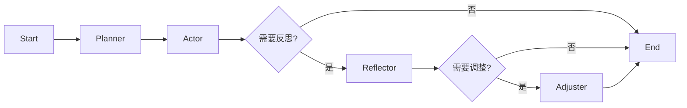

# CarbonCycle-FitAgent 运行逻辑总结

本文档总结了 CarbonCycle-FitAgent 的核心运行架构、数据流向以及智能体（Agent）的工作流程。

## 1. 系统架构概览

系统采用前后端分离的现代化架构：

*   **Frontend (前端)**: Next.js (React) + Tailwind CSS
    *   负责用户交互、数据展示（仪表盘、策略页）、以及调用后端 API。
    *   **关键页面**:
        *   `onboarding/page.tsx`: 新手引导，收集用户信息并生成初始计划。
        *   `page.tsx` (Dashboard): 每日打卡、查看今日计划、热量摄入。
        *   `strategy/page.tsx`: 查看和微调全周期的碳循环策略。
*   **Backend (后端)**: FastAPI (Python)
    *   提供 RESTful API，处理业务逻辑、数据库交互和 AI 智能体调度。
    *   **核心模块**:
        *   `app/api/`: 路由定义 (Auth, User, Plan, Log, Agent)。
        *   `app/core/`: 核心配置 (Database, Config, Logging)。
        *   `app/services/`: 业务逻辑 (CarbonStrategy, AgentService)。
*   **Database (数据库)**: SQLite (生产环境级配置)
    *   使用 SQLAlchemy (Async) 进行 ORM 映射。
    *   数据库文件位于 `data/carboncycle.db`。

---

## 2. 核心业务流程

### 2.1 用户注册与引导 (Onboarding)
1.  **输入**: 用户在前端填写基本信息（年龄、体重、目标、训练频率）。
2.  **处理**: 前端调用 `POST /api/plans/`。
3.  **逻辑**: 后端 `CarbonStrategyService` 根据 TDEE 公式和碳循环规则（高/中/低碳日比例）计算每日热量和宏量营养素 (Macros)。
4.  **存储**: 生成的 `CarbonCyclePlan` 和 `DayPlan` 存入 SQLite。

### 2.2 每日追踪与反馈
1.  **展示**: 仪表盘调用 `GET /api/plans/user/{id}/active` 获取今日计划。
2.  **记录**: 用户上传饮食图片或手动输入，调用 `POST /api/logs/`。
3.  **状态**: 系统对比“计划摄入”与“实际摄入”，计算差值。

---

## 3. AI 智能体 (Agent) 运行逻辑

系统核心是一个基于 **LangGraph** 的状态机智能体，负责像真人教练一样进行分析、反思和计划调整。

### 3.1 架构设计
智能体采用了 **Planner-Actor-Reflector-Adjuster** (计划-执行-反思-调整) 架构：

### 3.2 节点功能详解

1.  **Planner (规划者)**
    *   **输入**: 用户画像、当前计划、最近7天的饮食/训练日志。
    *   **职责**: 分析当前状态，判断用户执行情况（是否达标、是否有异常）。
    *   **输出**: 规划下一步行动方向。

2.  **Actor (执行者)**
    *   **职责**: 基于规划生成具体的交互内容，例如生成鼓励话语、提醒或建议。
    *   **输出**: 给用户的自然语言消息。

3.  **Reflector (反思者)**
    *   **触发条件**: 当检测到用户进度通过 `Actor` 阶段后，如果有必要深入分析（例如体重停滞、连续超标）。
    *   **职责**: 深度分析原因（是代谢适应？还是执行不力？）。决定是否需要修改计划。

4.  **Adjuster (调整者)**
    *   **触发条件**: `Reflector` 判定需要调整计划。
    *   **职责**: 调用 `AdjustmentEngine`，实际修改数据库中的 `CarbonCyclePlan`（例如：降低目标热量 -200kcal，或将高碳日改为中碳日）。
    *   **结果**: 计划更新，用户端自动同步。

### 3.3 触发机制
*   **手动触发**: 用户点击“生成反馈”或“AI 教练”。
*   **自动触发**: 系统后台任务（Background Task）定期运行，或在用户完成一周打卡后触发。

---

## 4. 近期进展与优化
*   **数据一致性**: 修复了策略调整后数据库未更新的问题，确保前端修改实时持久化。
*   **用户体验**: 优化了注册流程的枚举校验，增强了策略页面的视觉可读性。
*   **工程规范**: 清理了临时测试脚本，日志系统完善。

此文档作为系统逻辑的最新快照。
